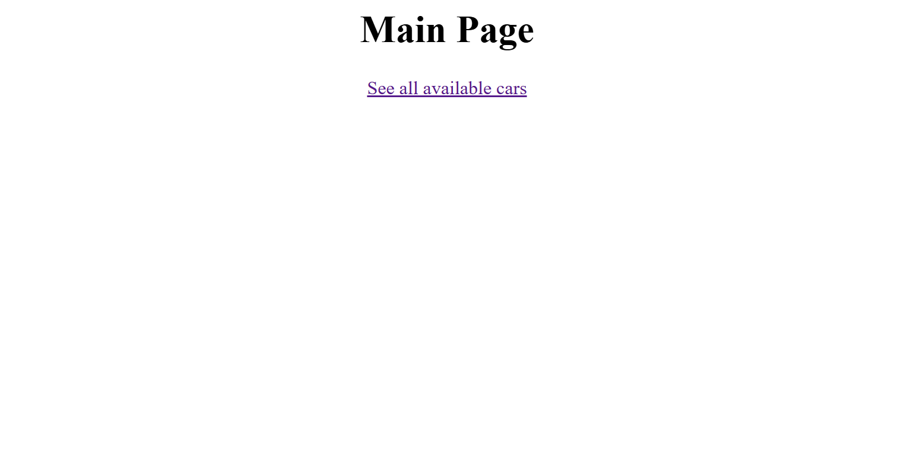
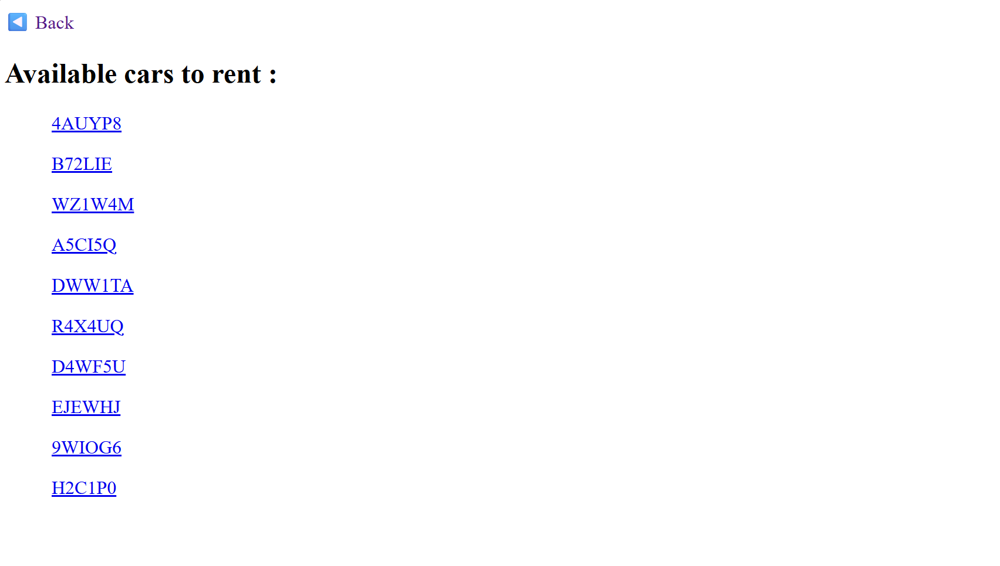
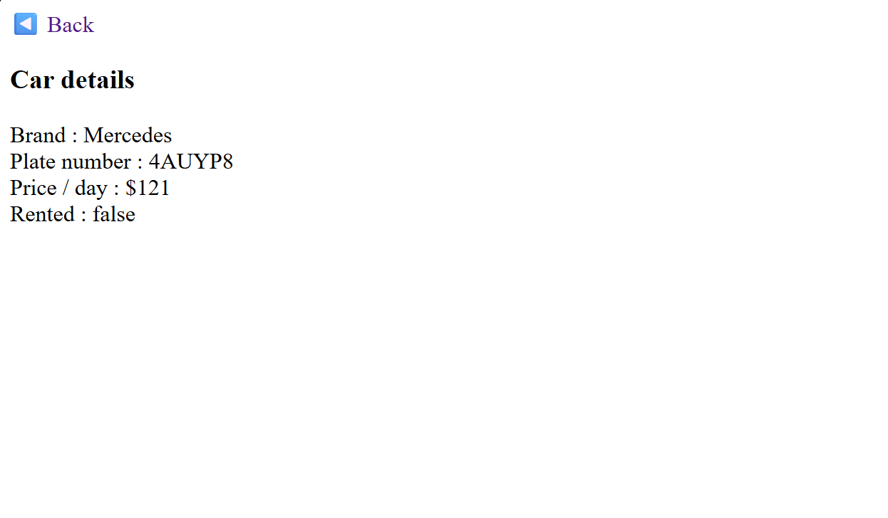

# TP - Car Rental System

## Overview

I split the system in two : 
- pages to GET a json response (like asked in the TP)
- pages to display (or "pretty print") 

To rent a car, you have to paste this command, and replace `PLATE_NUMBER` with the actual plate number :
``` Powershell
curl -X PUT "http://localhost:8080/cars/PLATE_NUMBER?rent=true" -H "Content-Type: application/json" -d "{\"begin\":\"1/1/2026\",\"end\":\"1/1/2027\"}"
```

And to return it :

``` Powershell
curl -X PUT "http://localhost:8080/cars/PLATE_NUMBER?rent=false"
```

## Preview

> landing page at `localhost:8080/`


> `/view/cars` calls API at `/cars`


> `/view/cars/4AUYP8` calls API at `/cars/4AUYP8`


> after renting it with command seen above

