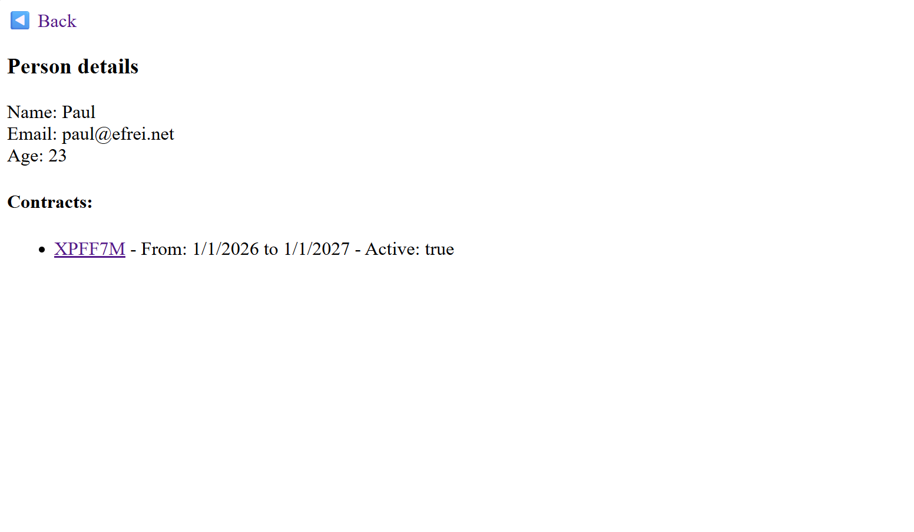

# TP - Car Rental System

## Overview

I split the system in two : 
- pages to GET a json response (like asked in the TP)
- pages to display (or "pretty print") 

To rent a car with a contract attached to a person, paste this command in command prompt, and replace `NAME` and `PLATE_NUMBER` :
```bash
curl -X PUT "http://localhost:8080/persons/NAME/rent?plate=PLATE_NUMBER" -H "Content-Type: application/json" -d "{\"begin\": \"1/1/2026\", \"end\": \"1/1/2027\"}"
```

*(or without dates :)*
```bash
curl -X PUT "http://localhost:8080/persons/NAME/rent?plate=PLATE_NUMBER"
```

To rent a car with no contract, you have to paste this command, and replace `PLATE_NUMBER` with the actual plate number :
```bash
curl -X PUT "http://localhost:8080/cars/PLATE_NUMBER?rent=true" -H "Content-Type: application/json" -d "{\"begin\": \"1/1/2026\", \"end\": \"1/1/2027\"}"
```

And to return it :
```bash
curl -X PUT "http://localhost:8080/cars/PLATE_NUMBER?rent=false"
```

## Preview

> landing page at `localhost:8080/`


> `/view/cars` calls API at `/cars`


> `/view/cars/4AUYP8` calls API at `/cars/4AUYP8`


> after renting it


> `/view/persons` calls API at `/persons`

 
> `/view/persons/Tonio` calls API at `/persons/Tonio`


> after renting a car
